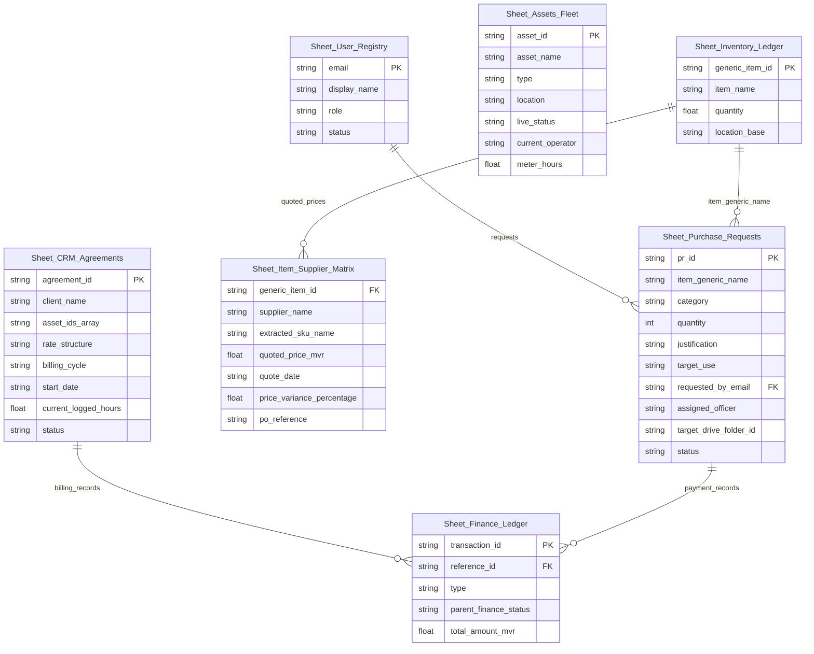

# Well Land Ops v3.0 - Relational Database Schemas & Seeds

This folder contains the fresh relational layout structures and blueprint templates for our paid Google Sheets database system. The schemas are fully optimized for multi-user role access (Admin, Procurement, Supervisor, Requestee) and are mapped below.

---

## Relational Entity-Relationship Diagram (Conceptual)

---

## Detailed Sheet Specifications

### 1. `Sheet_User_Registry`
Stores the active system users and controls role-based permission profiles.
*   **Columns**:
    *   `email` (PK): Unique email address of the user (e.g. `alie.mustarq@gmail.com`).
    *   `display_name`: Display name of the user.
    *   `role`: Allowed values: `Admin`, `Procurement`, `Supervisor`, `Requestee`.
    *   `status`: Allowed values: `Active`, `Inactive`, `Pending`.
*   **Initial Seed Data**:
    *   `alie.mustarq@gmail.com` | `Ali Musthaq` | `Admin` | `Active` *(Master Admin profile seeded automatically)*

### 2. `Sheet_Assets_Fleet`
Tracks our 4 active vessels and 20 heavy machinery units distributed across sites.
*   **Columns**:
    *   `asset_id` (PK): Unique identification string (e.g. `WL-MV-0001` or `WL-HV-0001`).
    *   `asset_name`: Name or Ref designation (e.g. `LCT 1` or `Volvo A40G Dump Truck`).
    *   `type`: Type of equipment (e.g. `LCT`, `Dhoni/Ferry`, `Speed Boat`, `Hauler Dump Truck`, `Low Bed Excavator`).
    *   `location`: Current location base (allowed: `Thilafushi`, `Muthaafushi`, `Bodufinolhu`).
    *   `live_status`: Status designation (e.g. `Active`, `Running`, `Standby`, `Grounded`, `Drydocked`, `New — Verify`).
    *   `current_operator`: Name of captain, crew, or operator currently in charge.
    *   `meter_hours`: Floating-point counter representing operating hours.

### 3. `Sheet_Purchase_Requests`
System for managing internal purchase requests and material requisitions.
*   **Columns**:
    *   `pr_id` (PK): Requisition Reference ID (e.g. `PR-0001`).
    *   `item_generic_name`: Reference to `generic_item_id` in `Sheet_Inventory_Ledger`.
    *   `category`: Category of supply (e.g. `Electrical`, `MRO`, `Consumables`, `Heavy Machinery`).
    *   `quantity`: Numeric amount requested.
    *   `justification`: Reason or explanation for request.
    *   `target_use`: Asset or vessel where item will be deployed (e.g. `WL-HV-0002` or `WL-MV-0001`).
    *   `requested_by_email` (FK): Links to `Sheet_User_Registry.email`.
    *   `assigned_officer`: Person handling the procurement process.
    *   `target_drive_folder_id`: Saved Google Drive folder path for quotes and documentation.
    *   `status`: Allowed values: `Request Received`, `RFQ Sent`, `PO_Raised`, `Completed`, `Cancelled`.

### 4. `Sheet_Item_Supplier_Matrix`
Cross-reference pricing, SKUs, and quotes from our 109 verified suppliers.
*   **Columns**:
    *   `generic_item_id` (FK): Links to `Sheet_Inventory_Ledger.generic_item_id`.
    *   `supplier_name`: Name of verified vendor (e.g. `Alia Investments Pvt Ltd`, `Komatsu`, `Jan De Nul`).
    *   `extracted_sku_name`: Exact part code or model designation on the quote.
    *   `quoted_price_mvr`: Price of the item in Maldivian Rufiyaa (MVR).
    *   `quote_date`: Date quote was issued (YYYY-MM-DD).
    *   `price_variance_percentage`: Automatic trend calculation vs last quote (+% / -%).
    *   `po_reference`: Generated PO reference code once approved.

### 5. `Sheet_Inventory_Ledger`
Tracks baseline stock balances for all 421 registered items across our base and project sites.
*   **Columns**:
    *   `generic_item_id` (PK): Unique item handle (e.g. `INV-0001` or general item name).
    *   `item_name`: Descriptive name of item.
    *   `quantity`: Available quantity on hand.
    *   `location_base`: Storage site (e.g. `Thilafushi`, `Muthaafushi`, `Bodufinolhu`).

### 6. `Sheet_CRM_Agreements`
Manages the active lease contracts and daily/hourly billing structures with our 5 clients.
*   **Columns**:
    *   `agreement_id` (PK): Contract reference (e.g. `RA0001`).
    *   `client_name`: Client company name (e.g. `Hilton Maldives Amingiri Resort & Spa`, `Antrac Holding`, `Evosun Maldives Pvt Ltd`).
    *   `asset_ids_array`: JSON string of asset IDs assigned (e.g. `["WL-HV-0010"]`).
    *   `rate_structure`: Contracted billing rates and conditions (daily/hourly rates, mobilization fees, etc.).
    *   `billing_cycle`: e.g. `Project-based`, `Daily`, `Retainer`.
    *   `start_date`: Start date of billing (YYYY-MM-DD).
    *   `current_logged_hours`: Hours or days currently logged for invoice generation.
    *   `status`: Allowed values: `Active`, `Pending`, `Completed`, `Suspended`.

### 7. `Sheet_Finance_Ledger`
Central finance tracking log mapping transactions to parent CRM agreement or PR.
*   **Columns**:
    *   `transaction_id` (PK): Unique ledger ID (e.g. `TX-0001`).
    *   `reference_id`: Links to a parent `agreement_id` or `pr_id`.
    *   `type`: Allowed values: `Payable` (procurement costs), `Receivable` (client rentals).
    *   `parent_finance_status`: Status of the payment (e.g. `Pending`, `Partially Paid`, `Paid`, `Overdue`).
    *   `total_amount_mvr`: Final transaction value in MVR (including relevant taxes).
